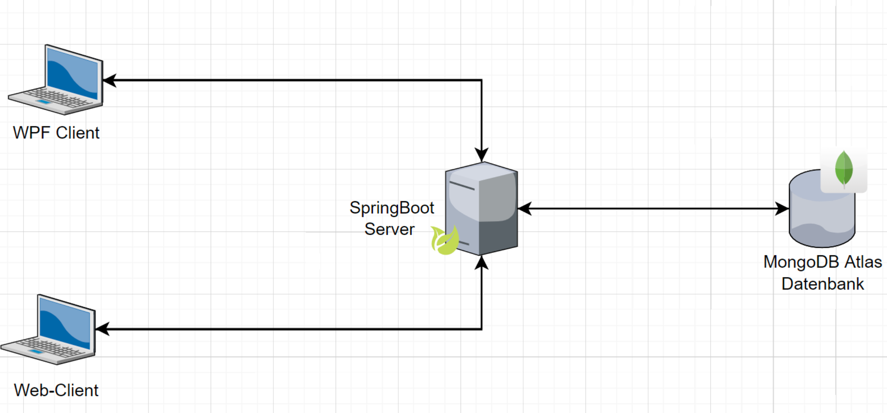

# TODO-Liste-API
## 1. Einleitung
Es soll eine Software entwickelt werden, die aus 2 Clients und einem Server besteht. Die beiden Clients sollen über ein **REST-API** mit dem Server kommunizieren. Die API soll auf jeden Fall die **CRUD-Operationen** (Create, Read, Update, Delete) entahlten. In meinem Projekt kamen dabei folgende Technologien zum Einsatz:
- **_Dokumentation:_**
	- Markdown in Obsidian
- **_Backend_**
	- Server: Java mit SpringBoot
	- Cloud-Datenbank: **MongoDB Atlas**
- **_Clients_**
	- Desktop-App mit **C# und WPF**
	- Web-App mit Fontend-Framework **React**

### 1.1. Beschreibung der API
Meine API ist eine ToDo-API. Der Sinn dieser besteht daraus, dass ich meine wichtigsten Aufgaben, die ich am Tag oder in der aktuellen Woche erledigen muss, gebündelt in einer Liste habe und diese je nach Proirität abarbeiten kann. Wenn ich ein ToDo erledigt habe, kann ich es löschen oder einfach nur abhaken. 

## 2. Softwareaufbau
#### Übersichtsdiagramm

#### Verteilungsdiagramm

