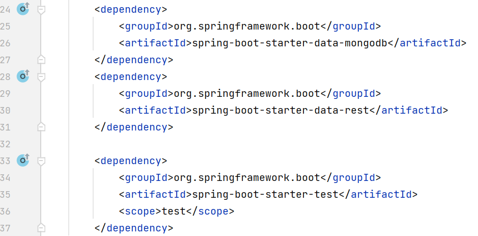
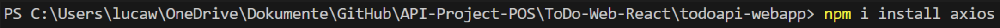
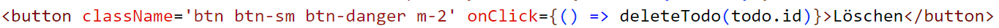

# TODO-Liste-API
## 1. Einleitung
Es soll eine Software entwickelt werden, die aus 2 Clients und einem Server besteht. Die beiden Clients sollen über ein **REST-API** mit dem Server kommunizieren. Die API soll auf jeden Fall die **CRUD-Operationen** (Create, Read, Update, Delete) entahlten. In meinem Projekt kamen dabei folgende Technologien zum Einsatz:
- **_Dokumentation:_**
	- Markdown in Obsidian
- **_Backend_**
	- Server: Java mit SpringBoot
	- Cloud-Datenbank: **MongoDB Atlas**
- **_Clients_**
	- Desktop-App mit **C# und WPF**
	- Web-App mit Fontend-Framework **React**

### 1.1. Beschreibung der API
Meine API ist eine ToDo-API. Der Sinn dieser besteht daraus, dass ich meine wichtigsten Aufgaben, die ich am Tag oder in der aktuellen Woche erledigen muss, gebündelt in einer Liste habe und diese je nach Proirität abarbeiten kann. Wenn ich ein ToDo erledigt habe, kann ich es löschen oder einfach nur abhaken. 

## 2. Softwareaufbau
#### Übersichtsdiagramm

#### Verteilungsdiagramm

### 2.1. Beschreibung der Software - Backend
#### 2.1.1 SpringBoot-Anwendung - Server
Spring Boot wird benötigt damit ein Client (in meinem Fall die WPF-Anwendung und die React-App) Daten an die Datenbank senden und empfangen kann. Das Senden und Empfangen von Daten erfolgt über HTTP-Methoden. Der Client schickt eine HTTP-Request an SpringBoot, danach verarbeitet SpringBoot die gesendete Request mithilfe von REST-Endpoints. Diese Endpoints haben wiederum Zugriff auf die Datenbank und können somit die Daten in der Datenbank an den Client schicken.

Die Projekthierarchie: 

**_Die SpringBoot-Apllikation sieht so aus_:**
1. Die Main-Klasse. Sie ist die Klasse, die ausgeführt wird.

Dabei ist die Annotation `@SpringBootApplication` anzufügen, damit das Java-Programm als SpringBoot-Applikation wahrgenommen wird.

2. Die `ToDo`-Klasse. Darin befinden sich die benötigten Attribute, die ein ToDo-Objekt braucht.

3. Die `ToDoController`-Klasse. Diese Klasse ist quasi das Herzstück der Spring-Applikation und  nimmt Anfragen von den Clients entgegen, verarbeitet diese und sendet die entsprechende Antwort zurück. Diese Klasse ist der Vermittler zwischen Client und der Anwendung und steuert den Ablauf der Abfragen.
 
Die Annotation `@RestController` legt diese Klasse als jene fest, die die HTTP-Request handlet. `@CrossOrigin` wird benötigt, damit das Senden und Empfangen von Daten mit dem axios-HTTP-Client möglich ist (Mehr dazu in "Punkt 2.2.1.1 Aufsetzen eines React Projekts") und kein Cross-Origin-Header-Fehler auftritt. Der * in der Klammer bewirkt, dass egal von welcher Domäne aus gesendet wird, kein Cross-Origin-Header-Fehler geworfen wird. Des Weiteren wird ein `repository`-Objekt der `ToDoRepository` erstellt, welches in den Endpoints die benötigten Funktionen aufrufen kann.
   
Der GET-Endpoint: 
 
`@RequestMapping` informiert darüber, dass der folgende Code eine GET-Methode handlen soll. Unter dem danebenstehenden Pfad "/ToDos/all" können alle ToDo-Objekte abgerufen werden. Das anzeigen aller Objekt wird von `repository.findAll()` übernommen.
   
Der POST-Endpoint: 
 
`@PostMapping` informiert darüber, dass der folgende Code eine POST-Methode handlen soll. Unter dem danebenstehenden Pfad "/ToDos/save" kann ein neues ToDo-Objekt in die Datenbank gespeichert werden. Die `@RequstBody`-Annotation wird verwendet, um die Eingabedaten einer HTTP-Anfrage zu erhalten und sie in ein entsprechendes Objekt umzuwandeln. `repository.save(newToDo)` speichert das neue ToDo-Objekt in die Datenbank.
   
Der PUT-Endpoint: 
`@PutMapping` informiert darüber, dass der folgende Code eine PUT-Methode handlen soll. Unter dem danebenstehenden Pfad "/ToDos/{id}" werden die alten Werte des ToDo-Objekts mit den neuen Werten, die die PUT-Methode sendet, überschrieben. Das {id} im Pfad stellt die Id des Objektes in der Datenbank dar, von dem die Werte geändert werden sollen. Die `@PathVariable`-Annotation wird verwendet, um Teile einer URL-Adresse zu extrahieren und als Parameter in einer Spring-Boot-Methode zu verwenden, also in desem Fall die Id. `repository.findById(id)`  sorgt dafür, dass das Objekt, das geändert werden soll, per Id gefunden wird, die dazugehörigen Werte schlussendlich ändert und in die Datenbank speichert.
   
Der DELETE-Endpoint: 
 
`@DeleteMapping` informiert darüber, dass der folgende Code eine DELETE-Methode handlen soll. Unter dem danebenstehenden Pfad "/ToDos/{id}" wird das ToDo-Objekt mit der im Pfad stehenden Id aus der Datenbank gelöscht. Für das Löschen aus der Datenbank sorgt `repository.deleteById(id)`.

4. Das `ToDoRepository`-Interface. Das Repository-Interface steht für eine Komponente, die für den Zugriff auf eine Datenbank oder eine andere Datenquelle verantwortlich ist. Sie stellt eine Abstraktionsschicht zwischen der Datenbank und der restlichen Anwendung bereit. 

Diese Klasse greift mithilfe der `MongoRepository`-Schnittstelle auf eine MongoDB-Datenbank zu. Die Klasse ist mit der Annotation `@RepositoryRestResource` gekennzeichnet, die spezielle Konfigurationen für die RESTful-Schnittstelle des Repositories festlegt. Die `collectionResourceRel`-Eigenschaft definiert den Namen der Ressourcen-Sammlung, die vom Repository repräsentiert wird (in diesem Fall "ToDoListe"). Die `path`-Eigenschaft gibt den Pfad an, unter dem die Ressourcen erreichbar sind ("ToDo"). `findByWhatToDo(String whatToDo)` ermöglicht das Suchen von ToDo-Objekten anhand des Wertes der `whatToDo`-Eigenschaft. Das bedeutet, dass die Methode alle ToDo-Objekte zurückgibt, bei denen der Wert der `whatToDo`-Eigenschaft mit dem angegebenen Wert übereinstimmt.
   
5. Die `application.properties`-Datei ist eine Konfigurationsdatei, inder man Einstellungen und Eigenschaften für die Anwendung festlegt. Beispiele für Konfigurationsoptionen sind Serverkonfigurationen (z.B. den Server-Port) oder Datenbankunfigurationen (Verbindung zur Datenbank). 

Damit jedoch alle gezeigten Komponenten zusammenarbeiten können, müssen sogenannte Dependencies in einer `pom.xml`-Datei eingebunden sein. Die `pom.xml`-Datei enthält Informationen über das Projekt und seine Dependencies sowie die Build-Konfiguration. Es ermöglicht die Integration von Spring-Modulen und anderen Bibliotheken, um die Entwicklung von Spring-Anwendungen zu erleichtern. 
 
Die obigen Dependencies werden benötigt, damit MongoDB, aber auch SpringBoot gemeinsam funktioniert. 

**_Actuator_** 
In den Vorgaben für die Umsetzung des Projektes ist gefordert, dass der Server einen "Health"-Status bereitstellen soll. Um diese Anforderungen zu erfüllen kommt der Actuator ins Spiel. Dieser ermöglicht es mithilfe von REST-Endpunkten, wichtige Informationen über die laufende Anwendung bereitzustellen. Eine Information darunter ist "Health", die es ermöglicht nachzusehen ob die Anwendung erfolgreich gestartet wurde. Man kann den Status folgendermaßen Prüfen:

Im Browser mit oben gezeigten Pfad. 

Oder in Insomnia bzw. in Postman. 

#### 2.1.2. MongoDB Atlas - Datenbank
Für mein kleines Projekt habe ich mich für MongoDB als Datenbank entschieden. Da jedoch nicht gewollt ist, dass die Datenbank auf einem lokalen Gerät abgelegt ist, habe ich mich dazu entschieden MongoDB Atlas zu verwenden. Atlas bietet den großen Vorteil, dass meine Datenbank rund um die Uhr online ist und ich somit jeder Zeit Daten senden und empfangen kann.

Damit sich der Client überhaupt zur Datenbank verbinden kann muss in der `application.properties`-Datei der SpringBoot-Anwendung folgende Zeile Code hinein:

`spring.data.mongodb.uri` benötigt die URL-von dem MonoDB Atlas Cluster. Diesen Link kann man einfach aus der GUI von Atlas kopieren.

So sieht die Datenbank in der Atlas-GUI aus. Ein Client kann diese Daten abfragen sowie auch bearbeiten und Löschen.

### 2.2. Beschreibung der Software - Clients
#### 2.2.1 Web-App mit React
##### 2.2.1.1. Aufsetzten eines React Projekts
_Alle diese Installationen sind im Terminal in Visual Studio Code erfolgt._
Als erstes muss man ein React-Projekt erstellen:

Damit man HTTP-Methoden in React durchführen kann installiere ich noch einen HTTP-Client für den Browser. Dieser Client trägt den Namen "axios" und mit dessen Hilfe können sämtliche HTTP-Methoden realisiert werden:

Damit sich die einzelen Komponenten erreichen können benötigt man folgendes Paket:

Damit man die Web-App gut designen kann sollte man auch noch Bootstrap installieren:

##### 2.2.1.2. HTTP-Methoden
Die HTTP-Methoden in React sind mit dem HTTP-Client axios realisiert worden. Damit man React verstehen kann muss man wissen was Hooks sind: React-Hooks erlauben es Funktionen auf den aktuellen State und auf andere React-Komponenten zuzugreifen. Wegen diesen Hooks werden in React keine Klassen benötigt

1. GET-Methode 
   Als erstes benötigt man den `useState`-Hook. Dieser akzeptiert einen State und returned zwei Werte, den aktuelle State also `todos` und die Funktion die den aktuellen State updated, also `setTodos`. 
   Der zweite Hook der benötigt wird, ist der `useEffect`-Hook. Dieser erlaubt es uns sogenannte side effect auf unsere Komponenten anzuwenden. Einer der side effects ist das direkte updaten des DOMs, das bedeutet das nach jeder Neuladung einer Seite, dieser aktualisiert wird. In unserem Fall bietet es uns den Vorteil, dass nach dem mal neu laden die GET-Methode ausgeführt wird und unsere Seite ständig die aktuellsten Daten bereitstellt. 
   Die `loadTodos`-Funktion ist asynchron, das bedeutet dass durch das Warten auf das Ergebnis der Anfrage mit `await` sichergestellt wird, dass die Funktion erst fortgesetzt wird, wenn die Anfrage abgeschlossen und das Ergebnis erhalten wurde. Die Funktion `loadTodos` ermöglicht also das Abrufen der ToDo-Daten von der API und die Sortierung (absteigend) der Daten nach Priorität. Als letztes wird mit `setTodos` der `useState` aktualisiert.

2. POST-Methode
   Der `useNavigate`-Hook wird dazu verwendet, um leicht zur angegebene Seite zu navigieren, das sieht man in der `onSubmit`-Funktion. Der Unterschied zur GET-Methode bei `useState` ist, dass hier die Attribute festgelegt werden die ein ToDo-Objekt enthalten muss. 
   Die nächste Zeile Code zerlegt (destrukturiert) das `todos`-Objekt in die angegebene seperaten Variablen. Das hat den Vorteil, dass dies Variablen im restliche Code selbständig, also ohne `todos.VARIABLEN-NAME` benutzt werden kann. 
   Die `onInputChange`-Funktion akzeptiert ein Ereignisobjekt (`e`) als Parameter, das Informationen über das auslösende Ereignis enthält, z. B. den Wert des Eingabefelds, das geändert wurde. Es wird ein neues Objekt erstellt, das den bestehenden Zustand `todos` mit dem Spread-Operator `...todos` kopiert und dann die Eigenschaft mit dem Namen `e.target.name` auf den Wert `e.target.value` setzt.
   In der `onSubmit`-Funktion wird  `e.preventDefault()` aufgerufen, um das Standardverhalten des Formulars zu verhindern, damit die Seite nicht neu geladen wird. Mit `axios.post` werden die Daten des neuen `todos`-Objekt an die API geschickt.

3. PUT-Methode 
   Die meisten Sachen unterscheiden sich nicht von der POST-Methode. Der `useParams`-Hook erlaubt den Zugriff auf den Wert diese Parameters, in diesem Fall `id`, wenn in der Route eine dynamische Parameterplatzhalter festgelegt hast, z. B. `"/todos/:id"`. Das würde so aussehen: 
    
   Auf Routes wird später eingegangen.
   Die `onSubmit`-Funktion unterscheidet sich mit `axios.put` gegenüber der `onSubmit`-Funktion bei der POST-Methode. Aber es wird auch im angegebenen Pfad zur API die `id`-Variable angefügt. Das hat den Grund, dass es die `id` des `todos`-Objektes, welches geändert werden soll, sein muss, damit dieses Objekt überhaupt bearbeitet werden kann.
   Die `loadTodo`-Funktion beinhaltet die GET-Methode, jedoch eine andere als zuvor beschrieben. Bei dieser ist es der Fall, das nur das Objekt mit der passenden `id` von der API abgerufen wird. Der Grund dafür ist, dass wenn das Objekt geändert werden soll, dann müssen alle Attribute dieses `todos`-Objekts in die Eingabefelder hineinkommen.

4. Die DELETE-Methode  
  Die `deleteTodo`-Funktion löscht das Objekt mir der entsprechenden `id` mit `axios.delete` und wird dann ausgeführt wenn der Löschknopf gedrückt wird: 
   
   `onClick` sorgt dafür das die Funktion ausgeführt wird. Dabei wird die `id` des `todos`-Objekt als Parameter mitgegeben.
   Mit `loadTodos` wird die Seite neu geladen und das gelöschte Objekt wird nicht mehr angezeigt und ist aus der Datenbank gelöscht worden.

##### 2.2.1.3. React-Router
React Router wird dazu verwendet um via URL zu einer anderen Seite zu gelangen. Beispielsweise kann man von der `App.js` Datei zur `Home.js`-Datei mithilfe von `/home`  gelangen: 
 
Wie man im obigen Screenshot erkennen kann befinden sich im `BrowserRouter` die `Routes` und darin befinden sich wiederum mehrere `Route`-Elemente. Bei `exact path` trägt man den Pfad ein, unter dem man die Seite, die in `element` verlinkt ist, erreicht.

Das Verwenden von React Router bietet noch einen Vorteil, man kann nämlich ein `Link`-Element erstellen, das auf die gewünschte Seite verweist. Der `Link`  wird statt dem `href="URL"` bei internen Pfaden verwendet. 
 
Hier seht man zum Beispiel, dass dieses `Link`-Element mit `to` auf die Home-Seite leitet. Diese Zeile Code befindet sich in der `ToDoAdd.js`-Datei und leitet danach auf die `Home.js`-Datei weiter.

#### 2.2.2 WPF-App in C\#
##### 2.2.2.1. HTTP-Methoden
1. GET-Methode 
   Als erstes wird als globale Variable ein HTTP-Client festgelegt damit alle Funktionen auf diesen Client zugreifen können und keine doppelte implementation nötig ist. In der Funktion `getApiContent` werden die Daten mittels der `GetStringAsync`-Funktion von der API abgefragt und in einen String gespeichert. Dieser String, indem das JSON-Objekt nun gespeichert ist, wird danach mithilfe von einem JsonConverter in ein .Net-Objekt umgewandelt und in ein ToDo-Array gespeichert. Den JsonConverter bekommt man mit dem NuGet `Newtonsoft.Json`.
   Danach wird das Array absteigend sortiert
   
2. POST-Methode
   Als erstes wird ein neues `ToDo`-Objekt erstellt um die einzelnen Attribute mit den eingegebenen Werten zu befüllen. 
   Danach wird das `ToDo`-Objekt von einem .Net-Objekt in eine JSON-Objekt umgewandelt damit es dann den UTF8 Zeichen entsprechend mit dem Header "application/json" in einen String Content gespeichert werden kann. Der Header muss mitgegeben werden weil sonnst die POST-Methode nicht funktioniert. Anschließend wird der StringContent mit `PostAsync` and die API gesendet. Die Funktion in der dieser Code liegt ist asynchron, in C# ist diese Prinzip gleich wie in JavaScript bzw. React und wurde im Punkt 2.2.1.2. beschrieben.
   
3. PUT-Methode
   Die `getApiContent` Funktion wird einem `ToDo`-Array zugewiesen und `selectedWhatToDo` bekommt den `whatToDo`-Wert von dem ausgewählten Element der GUI-`ListBox`. In der nächsten Zeile wird in der `toDo`-Liste nach dem ersten Element, das dem `elem.whatToDo` gleicht gesucht. Dabei gibt `FirstOrDefault` entweder das gefundene Element zurück oder `null` wenn kein passendes Element gefunden wird.
   Wenn `selectedToDo` ungleich null ist, dann werden die alten Werte der Attribute mit den Neuen überschrieben. Danach passiert das gleiche wie in der POST-Methode nur mit dem Unterschied, dass bei PUT die `id` von dem `ToDo`-Objekt noch an den Pfad hinzugefügt werden muss, damit die API weiß, welcher Datensatz geändert wird.
   
   
4. DELETE-Methode
   
   Die `getApiContent` Funktion wird einem `ToDo`-Array zugewiesen und danach wird mit einer `foreach`-Schleife durch dieses Array iteriert. Wenn das ausgewählt Item in der `ToDoList`, welches eine `Listbox` für die GUI ist, dem `ToDo.whatToDo` gleicht, dann wird die `id` von diesem `ToDo`-Objekt dem Pfad in der DELETE-Request angefügt. Das Objekt mit derselbem `id` wird nun aus der Datenbank und GUI-`Listbox` gelöscht. 

## Diskussion der Ergebnisse
Im großen und ganzen muss man sagen, dass das Projekt eine sehr schöne Abwechslung war und mir persönlich Spaß gemacht hat, auch wenn hin und wieder die ein oder anderen Fehler aufgetreten sind. Einige davon waren folgende:

- C\# - WPF-App: Icon konnte nicht geladen werden, da das Bild in dessen Eigenschaften nicht als "Ressource" angegeben war. Lösung --> Rechtsklick auf die png-Datei > Eigenschaften >  

- React - Web-App: HTTP-Anfragen wurden von Cross-Origin-Header-Fehlern blockiert. Dafür musst man die Annotation `CrossOrigin("*")` in SpringBoot einfügen damit dieses Problem behoben wird. Der * sorgt dafür, dass bei jeder Domäne, die eine HTTP-Request über die Web-App sendet, akzeptiert wird.

- C\# - WPF-App: Durch einen Case-Insensetive Fehler konnten die Daten mit der PUT und POST-Request zwar in die Datenbank gespeichert werden, aber alle Werte waren `null`. Dieser Fehler konnte glücklicher Weise mit einer Zeile Code in der `application.properties`-Datei behoben werden. 

Natürlich könnte man diese gesamte Projekt noch um einiges weiter ausbauen. Beispielsweise könnte man noch andere HTTP-Methode implementieren, die WPF-App schöner gestalten oder die Web-App um sehr viele Sachen erweitern. Natürlich kann man mit den Technolgien, die hier verwendet wurden, sehr viel komplexere und kompliziertere Dinge umgesetzt werden. Jedoch genügt laut den verlangten Anforderungen ein trivialeres Beispiel, was auch gut so ist, denn somit bekommt man schon einmal ein Gefühl dafür, wie das Zusammenspiel der einzelnen Komponenten so funktioniert. Außerdem wurde uns in Sachen Server und Web-App einige Freiheit gewährt, deshalb habe ich mich dazu entschlossen React etwas genauer kennenzulernen und als Frontend-Framework einzusetzen. Eine weitere Vorgabe war es auch in Markdown zu kommentieren, am Anfang des Projekts war ich davon nicht so begeistert, doch je mehr ich das Projekt kommenterte, umso besser gefiel es mir Markdown zu verwenden. Zusammenfassend lässt sich jetzt noch sagen, dass die Umsetzung dieses Projekts ohne allzu großes Kopfzerbrechen erfolgreich durchgeführt wurde.

##### Quellen:
- [Building REST services with Spring](https://spring.io/guides/tutorials/rest/)
- [Spring Boot Integration with MongoDB Tutorial](https://www.mongodb.com/compatibility/spring-boot)
- [How to add an event handler using code - WPF .NET | Microsoft Learn](https://learn.microsoft.com/en-us/dotnet/desktop/wpf/events/how-to-add-an-event-handler-using-code?view=netdesktop-7.0)
- [Production-ready Features (spring.io)](https://docs.spring.io/spring-boot/docs/current/reference/html/actuator.html)
- [c# - Send HTTP POST request in .NET - Stack Overflow](https://stackoverflow.com/questions/4015324/send-http-post-request-in-net)
- [HttpClient.PostAsync Methode (System.Net.Http) | Microsoft Learn](https://learn.microsoft.com/de-de/dotnet/api/system.net.http.httpclient.postasync?view=net-7.0)
- [Make HTTP requests with the HttpClient - .NET | Microsoft Learn](https://learn.microsoft.com/en-us/dotnet/fundamentals/networking/http/httpclient)
- [StringContent Klasse (System.Net.Http) | Microsoft Learn](https://learn.microsoft.com/de-de/dotnet/api/system.net.http.stringcontent?view=net-7.0)
- [c# - How do I set up HttpContent for my HttpClient PostAsync second parameter? - Stack Overflow](https://stackoverflow.com/questions/18971510/how-do-i-set-up-httpcontent-for-my-httpclient-postasync-second-parameter)
- [c# - How Do I refresh window in wpf? - Stack Overflow](https://stackoverflow.com/questions/4916521/how-do-i-refresh-window-in-wpf)
- [How to connect Mongodb Atlas to Spring - Stack Overflow](https://stackoverflow.com/questions/60398285/how-to-connect-mongodb-atlas-to-spring)
- [How to display a message box - WPF .NET | Microsoft Learn](https://learn.microsoft.com/en-us/dotnet/desktop/wpf/windows/how-to-open-message-box?view=netdesktop-7.0)
- [How does one change title bar image in WPF Window? - Stack Overflow](https://stackoverflow.com/questions/5101895/how-does-one-change-title-bar-image-in-wpf-window)
- [Source von Image wird nicht gefunden | myCSharp.de](https://mycsharp.de/forum/threads/78838/source-von-image-wird-nicht-gefunden)
- [Spring Boot Actuator — External API Health Checks Integration | by Anji… | TechMonks | Medium](https://medium.com/techmonks/spring-boot-actuator-external-api-health-checks-integration-52e323a8d14c)
- [Sorting in React JS - Owlcation](https://owlcation.com/stem/creating-a-sortable-list-in-react-js)
- [Spring Boot](https://spring.io/projects/spring-boot)
- [React Hooks (w3schools.com)](https://www.w3schools.com/react/react_hooks.asp)
- [Asynchrone Programmierung – C# | Microsoft Learn](https://learn.microsoft.com/de-de/dotnet/csharp/asynchronous-programming/async-scenarios)
- [Bootstrap · The most popular HTML, CSS, and JS library in the world. (getbootstrap.com)](https://getbootstrap.com/)
- [List group · Bootstrap v5.3 (getbootstrap.com)](https://getbootstrap.com/docs/5.3/components/list-group/)
- [Accordion · Bootstrap v5.3 (getbootstrap.com)](https://getbootstrap.com/docs/5.3/components/accordion/)
